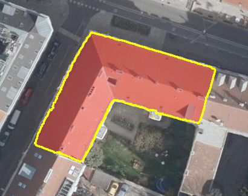

# Rooftop detection

This component extracts imagery-derived roof outlines for ten Vienna buildings. It combines the City of Vienna's 2024 true orthophoto (15 cm GSD) with official LOD0.4 building-part footprints and local [`facebook/sam2.1-hiera-large`](https://huggingface.co/facebook/sam2.1-hiera-large) segmentation.

## Run

The checked-in environment targets Python 3.14 and ROCm 7.2. The first inference run downloads approximately 898 MB of Hugging Face safetensor weights when they are not already cached.

```bash
uv sync --dev
uv run rooftop-detection run --config configs/vienna_c2.toml
```

`run` creates the ignored, georeferenced GeoTIFF when it is missing, reads one padded raster window per target, loads SAM2 once, and performs one initial inference per building. Weak masks are retried with footprint-derived positive and negative point prompts.

The individual stages are also available:

```bash
uv run rooftop-detection prepare --config configs/vienna_c2.toml
uv run rooftop-detection detect --config configs/vienna_c2.toml
```

## Inputs and outputs

- `data/raw/orthophoto_2024_35_4/` — committed JPEG/JGW imagery pair.
- `data/input/buildings.geojson` — ten target building parts in EPSG:31256.
- `outputs/roof_attributes.json` — valid WGS84 GeoJSON geometries, native projected areas, provenance, quality signals and review decisions.
- `outputs/overlays/*.png` — exact exported geometry over the source crop. Red is the polygon fill; yellow traces exterior and courtyard rings.

Example detection for `vienna-c2-5521477`:



Each result contains SAM's predicted IoU plus footprint precision, coverage and IoU. These are heuristic quality signals, not calibrated probabilities. A result is marked `review_required` when it leaks substantially, misses too much of the source footprint, has an implausible area ratio, or has weak SAM quality.

## Data and model provenance

- Imagery: City of Vienna Orthofoto 2024, tile 35/4, 15 cm, EPSG:31256, CC BY 4.0. [Original ZIP](https://www.wien.gv.at/ma41datenviewer/downloads/geodaten/op_img/35_4_op_2024.zip).
- Building prompts: City of Vienna LOD0.4 building model, queried through the [Vienna WFS](https://data.wien.gv.at/daten/geo).
- Model: Meta SAM2.1 Hiera Large, Apache-2.0. [Hugging Face model card](https://huggingface.co/facebook/sam2.1-hiera-large).
- Required attribution: `Datenquelle: Stadt Wien - data.wien.gv.at`.

The open datasets have no API/licensing cost. The exact source imagery, target list, outputs and overlays are committed so results remain reviewable without ROCm. Re-running inference requires a compatible PyTorch runtime; this lockfile is configured for the AMD Radeon RX 7900 XTX used for the assessment.

## Scope and limitations

The nadir orthophoto supports a projected roof outline and projected plan area. It does not directly support slope, true 3D surface area or structural condition. Roof type and material remain explicitly unknown in this baseline rather than being inferred without a validated classifier. A contemporaneous DOM/DGM would enable height, slope, aspect and more defensible 3D area.

Footprints identify the target and provide soft quality checks; they do not hard-clip the mask because official building-part boundaries can differ from visible eaves. Nearby roofs in a crop can therefore belong to different Vienna building IDs.

See [the design note](docs/design.md) for the full reasoning, confidence semantics and scaling plan.

## Testing and AI assistance

```bash
uv run ruff check src tests
uv run pytest -q
```

OpenAI Codex, including GPT-5.6 Terra, assisted with research, scaffolding, debugging and review. Data-source selection, visual inspection, implementation decisions and final outputs were reviewed interactively rather than accepted without verification.
